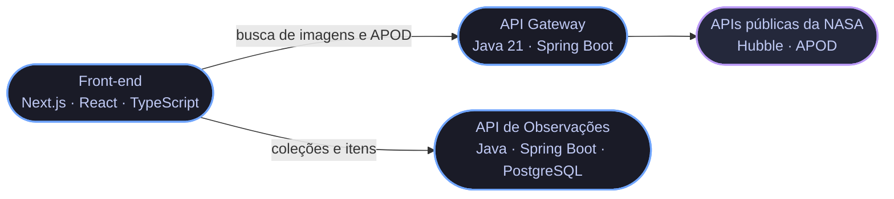

## Sobre mim

Desenvolvedor **Back-End**, formado em Análise e Desenvolvimento de Sistemas e
pós-graduado em **Engenharia de Software pela PUC-Rio**. Concluí a especialização
**Oracle Next Education (ONE)** em backend com Java e Spring Boot.

> Vim do **suporte técnico**, e isso mudou como eu escrevo código: aprendi a
> diagnosticar sistema quebrado com usuário esperando do outro lado, e trago essa
> cabeça para as decisões de arquitetura.

Hoje trabalho com **APIs REST, arquitetura em camadas e microsserviços**.

## Stack

**Back-end e dados**

**Front-end e ferramentas**

**Também aplico no dia a dia:** APIs REST · Microsserviços · Clean Code · SOLID ·
Arquitetura em camadas · Integração com APIs externas · Tratamento de exceções

## Projetos em destaque

### NASA Observações — três serviços, um sistema

MVP de arquitetura em microsserviços: **só o gateway conhece as APIs públicas da
NASA** — o front nunca fala com elas direto. Os dois serviços em Java sobem com
Docker e documentam as rotas em Swagger.

| Serviço | O que faz | Stack |
| --- | --- | --- |
| **[API Gateway](https://github.com/eliel2107/mvp-apigateway-nasa-java)** | Porta de entrada única: busca imagens do Hubble, serve a foto astronômica do dia (APOD, inclusive por intervalo de datas) e repassa a gestão de coleções ao serviço de observações. |   |
| **[API de Observações](https://github.com/eliel2107/mvp-api-observacoesnasa-java)** | Persiste coleções e itens em PostgreSQL, com migrations em Flyway. Não conhece a NASA: só guarda o que o usuário colecionou. |    |
| **[Front-end](https://github.com/eliel2107/mvp-frontend-nasa)** | Interface para buscar imagens, ver o APOD e montar coleções de observações. |    |

### Outros projetos

| Projeto | O que é | Stack |
| --- | --- | --- |
| **[ForumHub API](https://github.com/eliel2107/Challenge-ApiRestForumHub)** | API REST de tópicos de fórum, com CRUD completo em Spring Boot. |   |
| **[LiterAlura](https://github.com/eliel2107/Challenge-LiterAlura)** | Consome a API Gutendex para buscar livros e explorar autores. |  |
| **[MVP Microsserviços](https://github.com/eliel2107/MVP-microservicos)** | A primeira versão da arquitetura, na pós da PUC-Rio. |   |
| **[ProjetoIA](https://github.com/eliel2107/ProjetoIA)** | Aplicação interativa com Streamlit e LangChain. |  |

## GitHub

<!--
A cobrinha das contribuicoes ja esta pronta em .github/workflows/main.yml, mas o
workflow esta desativado. Para ligar: aba Actions > "Gera a cobrinha das
contribuicoes" > Enable workflow > Run workflow. Depois que a branch output
aparecer, e so descomentar o bloco abaixo.

  <picture>
    <source media="(prefers-color-scheme: dark)" srcset="https://raw.githubusercontent.com/eliel2107/eliel2107/output/github-contribution-grid-snake-dark.svg" />
    
  </picture>

-->

### Aberto a oportunidades como Desenvolvedor Back-End

