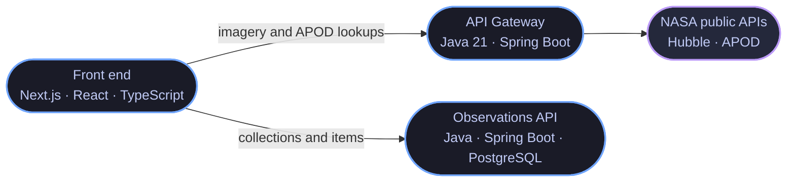

## About me

**Back-End developer** with a degree in Systems Analysis and Development and a
**postgraduate degree in Software Engineering from PUC-Rio**. I completed the
**Oracle Next Education (ONE)** backend specialization in Java and Spring Boot.

> I came from **technical support**, and it changed how I write code: I learned to
> diagnose a broken system with a user waiting on the other end, and I bring that
> mindset to architecture decisions.

Today I work with **REST APIs, layered architecture and microservices**.

## Stack

**Back end and data**

**Front end and tooling**

**Also part of my day-to-day:** REST APIs · Microservices · Clean Code · SOLID ·
Layered architecture · Third-party API integration · Exception handling

## Featured projects

### NASA Observations — three services, one system

A microservices MVP: **only the gateway knows NASA's public APIs** — the front
end never calls them directly. Both Java services ship with Docker and document
their routes in Swagger.

| Service | What it does | Stack |
| --- | --- | --- |
| **[API Gateway](https://github.com/eliel2107/mvp-apigateway-nasa-java)** | Single entry point: searches Hubble imagery, serves the Astronomy Picture of the Day (including date ranges) and forwards collection management to the observations service. |   |
| **[Observations API](https://github.com/eliel2107/mvp-api-observacoesnasa-java)** | Persists collections and items in PostgreSQL, with Flyway migrations. It knows nothing about NASA: it just stores what the user collected. |    |
| **[Front end](https://github.com/eliel2107/mvp-frontend-nasa)** | Interface to search imagery, browse the APOD and build observation collections. |    |

### Other projects

| Project | What it is | Stack |
| --- | --- | --- |
| **[ForumHub API](https://github.com/eliel2107/Challenge-ApiRestForumHub)** | REST API for forum topics, full CRUD in Spring Boot. |   |
| **[LiterAlura](https://github.com/eliel2107/Challenge-LiterAlura)** | Consumes the Gutendex API to search books and explore authors. |  |
| **[MVP Microservices](https://github.com/eliel2107/MVP-microservicos)** | The first take on the architecture, during the PUC-Rio program. |   |
| **[ProjetoIA](https://github.com/eliel2107/ProjetoIA)** | Interactive application built with Streamlit and LangChain. |  |

## GitHub

<!--
The contribution snake is already wired up in .github/workflows/main.yml, but the
workflow is disabled. To turn it on: Actions tab > "Gera a cobrinha das
contribuicoes" > Enable workflow > Run workflow. Once the output branch shows up,
uncomment the block below.

  <picture>
    <source media="(prefers-color-scheme: dark)" srcset="https://raw.githubusercontent.com/eliel2107/eliel2107/output/github-contribution-grid-snake-dark.svg" />
    
  </picture>

-->

### Open to Back-End Developer opportunities

